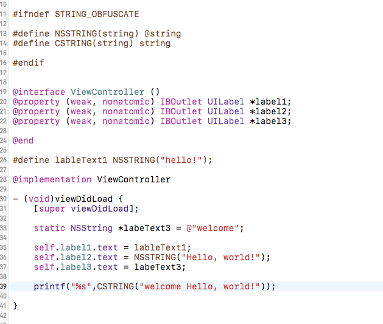
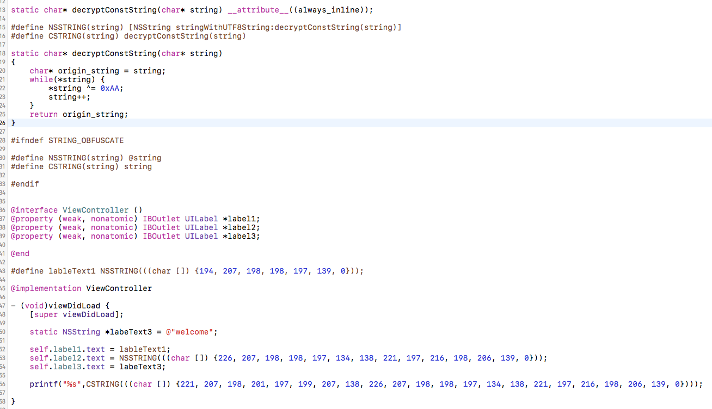
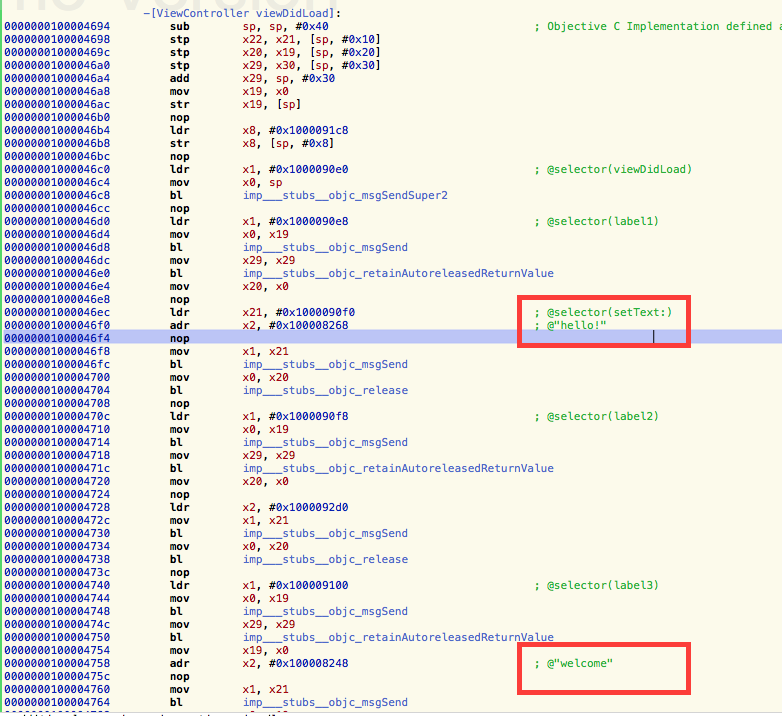
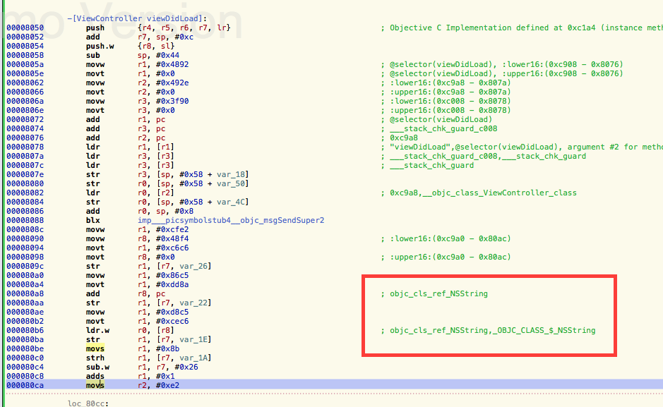
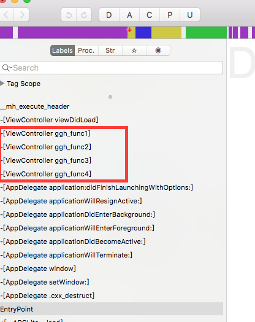
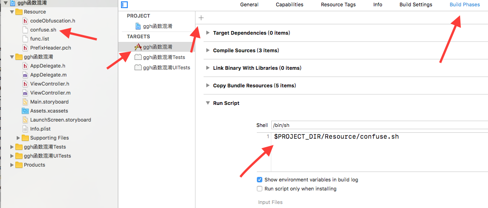
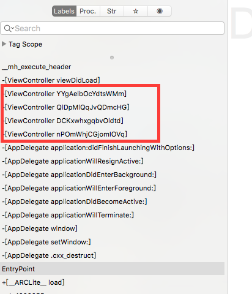

### 前提
众所周知，iOS系统安全性非常高，很少出现漏洞，几乎不会中毒。大家认为苹果系统的封闭性会使iOS APP安全性比较高，但是实际上iOS应用本身被破解的难度并不高，一旦在越狱设备上，ipa被分析就会变得很容易。对于iOS开发者来说，有必要了解一些APP加固的方法，用以提高破解的难度，特别是针对一些金融、游戏类APP的开发。
##### iOS代码保护
在大多数iOS应用中，一些工具，比如Clutch,class-dump,cycript,lldb,theos.对应用程序的结构，代码逻辑，运行流程，可以做到很容易的分析。然后进行应用的破解，篡改，重签名。可以从逆向分析的方式做代码保护的思路：

- 1.静态分析：针对这种情况可以把字符串加密，类名方法名混淆，代码混淆
- 2.调试	：反调试
- 3.注入	：反注入
- 4.中间人攻击 ：https, 证书验证, 数据加密

### 一，静态分析
静态分析是指用工具对程序结构，代码逻辑的分析。很大程度上取决关键字，通过关键字找到敏感代码，进行破解。所以静态分析的防护主要是代码混淆。
#### 1，混淆硬编码的明文字符串
明文字符串可直接在二进制包搜索到，常常是作为逆向分析的切入口，隐藏明文字符串可有效提升静态分析的难度。在源代码中将字符串加密，运行时先解密在使用，如果直接在代码中写加密后字符串，代码的可读性会变得非常差。网上又一个方法不是很优雅，但有效，私以为不错：

- 将源代码中的字符串通过函数宏手动标记
- 打包的时候拷贝源代码副本
- 执行脚本，将副本代码中所有标记过的字符串，替换成decrypt("密文")的形式
- 在适当的位置，插入decrypt函数的实现(或者事先在源代码中写好)
- 编译

通过函数宏手动标记字符串：


执行加密脚本后

这里的加密仅仅是做了一个简单的异或运算，解密函数内联编译到代码中。


上图是未做混淆前的反汇编代码，可以直接看到明文字符串。  
下面是经过混淆的反汇编代码，已经看不到明文字符串了。


#### 2，objective C代码混淆
网上方法较多，其中尤以念茜大神的方法为佳。大抵是在编译前执行混淆脚本，对OC函数（消息）进行混淆。但是又不能全部混淆，有一些是SDK的代理回掉，如tableView的UITableViewDataSource，混淆后将不会调用，如继承子类的init，混淆后也不会调用。解决办法有很多，这里介绍两个匹配的办法：  

- 1，建立一个索引文件，将需要混淆的函数写入索引文件，混淆脚本读取索引文件的函数名进行匹配。
- 2，在代码中以前缀或后缀的方式标识需要混淆的函数，混淆脚本通过这些标识进行自动混淆。

匹配函数名后，将混淆过的函数写入数据库中记录下来，以便在后续在分析app Crash的时候找对应的函数，快速定位到对应的代码.
为混淆的二进制包，可以直接看到代码中的函数名，逆向者以此猜测程序功能，快速切入。  
  

混淆脚本设置
  

混淆后的代码，无法通过函数名猜测到程序功能，可大大增加逆向难度。  
  
代码混淆除了函数名的混淆，还有类名，协议名，文件名的混淆等。此外，敏感代码可以用C函数来实现，可以避免在class-dump等工具中倒出，但是在nm等工具中还是可以看到一些符号表的信息。

###### 小结，静态分析的防护手段主要是作代码的混淆，已到达提升逆向的难度。此外还有代码逻辑的混淆，通过在代码中加入大量无用的逻辑判断，增加程序结构的复杂性，以此提升程序在ida，hopper等工具分析中的难度。但是此方法对源代码的改动性较大，识代码的可读性变得极差。

### 二，动态分析 反调试
逆向者不仅可以静态分析程序，也可以通过debugserver，lldb等工具动态分析程序，通过在程序中打断点，修改内存中的变量等方式分析，改变程序的行为。以为达到分析，hoock程序的目的。
#### 1，反调试之 ptrace
谈到debug，首先会想到的一个系统调用是ptrace，它主要用于实现断点调试和系统调用跟踪。 PT_DENY_ATTACH是苹果增加的一个ptrace选项，用以防止gdb等调试器依附到某进程。代码如下：  

```
#ifndef PT_DENY_ATTACH
#define PT_DENY_ATTACH 31
#endif

typedef int (*ptrace_ptr_t)(int _request, pid_t _pid, caddr_t _addr, int _data);

@implementation ViewController

- (void)viewDidLoad {
    [super viewDidLoad];


    void *handle = dlopen(0, RTLD_GLOBAL | RTLD_NOW);
    ptrace_ptr_t ptrace_ptr = (ptrace_ptr_t)dlsym(handle, "ptrace");
    ptrace_ptr(PT_DENY_ATTACH, 0, 0, 0);

}
```
手边没有越狱机器，直接通过xcode debug，应用会Crash掉，安装到手机后可正常打开。 
针对这种ptrace的反反调试方法其实很简单，通过下断点，然后修改ptrace的参数或者用hook函数去掉反调试保护就可以搞定。也可在程序多个处调用来增加crash

#### 2，反调试之 sysctl
思路是通过sysctl查看信息进程里的标记，判断自己是否正在被调试。sysctl是用以查询内核状态的接口，并允许具备相应权限的进程设置内核状态。其定义如下：

```
 int sysctl(int *name, u_int namelen, void *old, size_t *oldlen, void *newp, size_t newlen);
 name参数是一个用以指定查询的信息数组；
 namelen用以指定name数组的元素个数；
 old是用以函数返回的缓冲区；
 oldlen用以指定oldp缓冲区长度；
 newp和newlen在设置时使用；
 	当进程被调试器依附时，kinfo_proc结构下有一个kp_proc结构域，kp_proc的p_flag的被调试标识将被设置，即会进行类似如下的设置：
 	kinfo_proc. kp_proc. p_flag & P_TRACED
   其中P_TRACED的定义如下：
   #define P_TRACED        0x00000800  /* Debugged process being traced */
```
我们可以通过sysctl查询进程相应的kinfo_proc信息，查询函数的实现可以这样：

```
static int is_debugged() __attribute__((always_inline));

@implementation ViewController


- (void)viewDidLoad {
    [super viewDidLoad];

    if (is_debugged() == YES) {
        self.label.text = @"is_debugged ";
        exit(-1);
    }else{
        self.label.text = @"not is_debugged";
    }

}

static int is_debugged(){
    int name[4] = {CTL_KERN,KERN_PROC,KERN_PROC_PID,getpid()};
    struct kinfo_proc Kproc;
    size_t kproc_size = sizeof(Kproc);
    
    memset((void*)&Kproc, 0, kproc_size);
    
    if (sysctl(name, 4, &Kproc, &kproc_size, NULL, 0) == -1) {
        perror("sysctl error \n ");
        exit(-1);
    }
    
    return (Kproc.kp_proc.p_flag & P_TRACED) ? 1 : 0;
}

```
针对sysctl的反反调试的思路其实很简单，只需要在函数返回时清除p_flag标识位即可，根据sysctl.h文件中的定义：  

```
#define	CTL_KERN	1
#define	KERN_PROC 14
#define	KERN_PROC_PID 1
```
以及sysctl的第二个参数为4，对sysctl下条件断点，在sysctl返回后，根据反编译二进制文件找到kproc的首地址，接下来找到p_flag相对kproc首地址的偏移，最后修改对应内存地址的值就OK了。

###### 动态分析的防护还有很多，如：dylib注入检测，越狱检测等。当然，也有响应的发发调试手段。

### 三，总结
总体来说，iOS系统安全性是很高的，且大多数iOS应用都没做混淆，反调试等。对于金融类，游戏类的应用防护套路来一点还是能增加逆向破解的难度的。当然，要完全防止程序被调试或者被逆向，理论上来说是不可能的。

##### 参考文章
[iOS App的加固保护原理](http://www.cocoachina.com/ios/20170324/18955.html) http://www.cocoachina.com/ios/20170324/18955.html  
[念茜的博客 iOS安全攻防（二十四）：敏感逻辑的保护方案（1）](http://blog.csdn.net/yiyaaixuexi/article/details/29210413) http://blog.csdn.net/yiyaaixuexi/article/details/29210413  
[iOS代码混淆](http://xelz.info/blog/2016/11/20/ios-code-obfuscation/) http://xelz.info/blog/2016/11/20/ios-code-obfuscation/  
[对 iOS app 进行安全加固](https://danleechina.github.io/ios-app-security-reinforce/) https://danleechina.github.io/ios-app-security-reinforce/  
[iOS代码混淆----自动](http://www.jianshu.com/p/0d42e5c6361c) http://www.jianshu.com/p/0d42e5c6361c  
[阿里 iOS Anti-Debug](https://jaq.alibaba.com/blog.htm?id=53) https://jaq.alibaba.com/blog.htm?id=53  
[关于反调试&反反调试那些事](http://bbs.iosre.com/t/topic/8179)  http://bbs.iosre.com/t/topic/8179  
[看雪论坛 iOS加固浅谈之字符串加密](http://bbs.pediy.com/thread-217991.htm) http://bbs.pediy.com/thread-217991.htm
