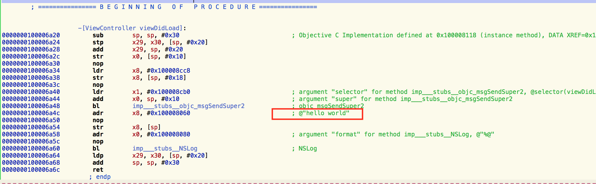
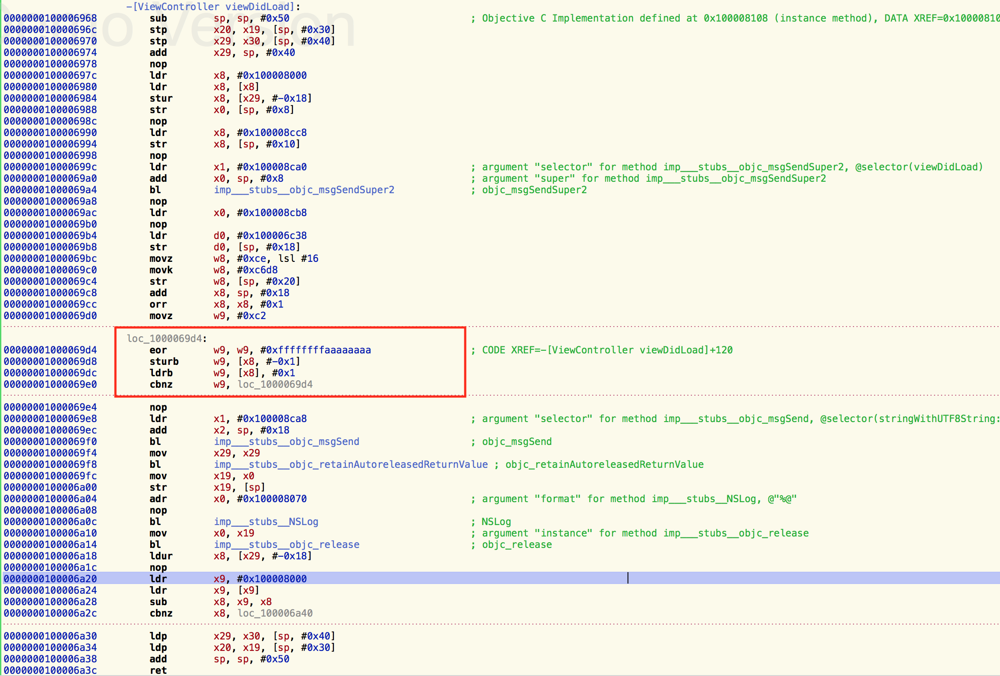

# iOS字符串硬编码混淆

### 前提
众所周知iOS应用在越狱设备上比较容易被逆向分析，而静态字符串的硬编码比较容易成为逆向者的突破口。因此有必要做一些字符串硬编码的混淆，如加密的对称加密key，md5的key，域名，接口名等。

### 混淆前
混淆前代码

```
@implementation ViewController

- (void)viewDidLoad {
    [super viewDidLoad];

    NSString *string = @"hello world";
    NSLog(@"%@",string);
}

@end
```
直接在源代码里面编写字符串，使用hopper可直接找到该串


### 混淆方案
这里采用的是直接修改源代码的方式做混淆。首先对需要混淆的字符串用宏打上标记，然后使用脚本过滤所有源代码，生成混淆过的代码。因为混淆过的代码可读性极差，不利于维护，所以就需要解混淆代码，用于把混淆过的代码做还原。

##### 混淆脚本
```
#!/usr/bin/env python
# encoding=utf8
# -*- coding: utf-8 -*-
# 本脚本用于对源代码中的字符串进行加密
# 替换所有字符串常量为加密的char数组，形式((char[]){1, 2, 3, 0})

import importlib
import os
import re
import sys


# 替换字符串为((char[]){1, 2, 3, 0})的形式，同时让每个字节与0xAA异或进行加密
def replace(match):
    string = match.group(2) + '\x00'
    replaced_string = '((char []) {' + ', '.join(["%i" % ((ord(c) ^ 0xAA) if c != '\0' else 0) for c in list(string)]) + '})'
    return match.group(1) + replaced_string + match.group(3)


# 修改源代码，加入字符串加密的函数
def obfuscate(file):
    with open(file, 'r') as f:
        code = f.read()
        f.close()
        code = re.sub(r'(confusion_NSSTRING\(|confusion_CSTRING\()"(.*?)"(\))', replace, code)
        code = re.sub(r'//#define ggh_confusion', '#define ggh_confusion', code)
        with open(file, 'w') as f:
            f.write(code)
            f.close()


#读取源码路径下的所有.h和.m 文件
def openSrcFile(path):    
    print("开始处理路径： "+ path +"  下的所有.h和.m文件")
    # this folder is custom
    for parent,dirnames,filenames in os.walk(path):
        #case 1:
#        for dirname in dirnames:
#            print((" parent folder is:" + parent).encode('utf-8'))
#            print((" dirname is:" + dirname).encode('utf-8'))
        #case 2
        for filename in filenames:
            extendedName = os.path.splitext(os.path.join(parent,filename))
            if (extendedName[1] == '.h' or extendedName[1] == '.m'):
                print("处理源代码文件: "+ os.path.join(parent,filename))
                obfuscate(os.path.join(parent,filename))


#源码路径
srcPath = '../hello String'

if __name__ == '__main__':
    print("本脚本用于对源代码中被标记的字符串进行加密")

    if len(srcPath) > 0:
        openSrcFile(srcPath)
    else:
        print("请输入正确的源代码路径")
        sys.exit()

```
运行该脚本 ``` $ python3 confusion.py  ``` 把标记过的代码混淆。

##### 生成混淆代码

```
/*
 *  字符串混淆解密函数，将char[] 形式字符数组和 aa异或运算揭秘
 *  如果没有经过混淆，请关闭宏开关
 */
extern char* decryptConstString(char* string)
{
    char* origin_string = string;
    while(*string) {
        *string ^= 0xAA;
        string++;
    }
    return origin_string;
}


//字符串混淆加密 和 解密的宏开关
#define ggh_confusion
#ifdef ggh_confusion
    #define confusion_NSSTRING(string) [NSString stringWithUTF8String:decryptConstString(string)]
    #define confusion_CSTRING(string) decryptConstString(string)
#else
    #define confusion_NSSTRING(string) @string
    #define confusion_CSTRING(string) string
#endif


@implementation ViewController

- (void)viewDidLoad {
    [super viewDidLoad];

    NSString *string = confusion_NSSTRING(((char []) {194, 207, 198, 198, 197, 138, 221, 197, 216, 198, 206, 0}));
    NSLog(@"%@",string);
}

@end
```

混淆后的代码已经看不到硬编码了。在内联函数中做异或运算。


##### 解混淆脚本
解混淆脚本用于还原代码，增加代码可读性。

```
#!/usr/bin/env python
# encoding=utf8
# -*- coding: utf-8 -*-
# 本脚本用于对源代码中的字符串进行解密
# 替换所有加密的char数组为字符串常量，""

import importlib
import os
import re
import sys


# 替换((char[]){1, 2, 3, 0})的形式为字符串，同时让每个数组值与0xAA异或进行解密
def replace(match):
    string = match.group(2)
    decodeConfusion_string = ""
    for numberStr in list(string.split(',')):
        if int(numberStr) != 0:
            decodeConfusion_string = decodeConfusion_string + "%c" % (int(numberStr) ^ 0xAA)

    # replaced_string = '\"' + "".join(["%c" % ((int(c) ^ 0xAA) if int(c) != 0 else '\0') for c in string.split(',')]) + '\"'
    replaced_string = '\"' + decodeConfusion_string + '\"'
    print("replaced_string = " + replaced_string)

    return match.group(1) + replaced_string + match.group(3)


# 修改源代码，加入字符串加密的函数
def obfuscate(file):
    with open(file, 'r') as f:
        code = f.read()
        f.close()
        code = re.sub(r'(confusion_NSSTRING\(|confusion_CSTRING\()\(\(char \[\]\) \{(.*?)\}\)(\))', replace, code)
        code = re.sub(r'[/]*#define ggh_confusion', '//#define ggh_confusion', code)
        with open(file, 'w') as f:
            f.write(code)
            f.close()


#读取源码路径下的所有.h和.m 文件
def openSrcFile(path):  
    print("开始处理路径： "+ path +"  下的所有.h和.m文件") 
    # this folder is custom
    for parent,dirnames,filenames in os.walk(path):
        #case 1:
#        for dirname in dirnames:
#            print((" parent folder is:" + parent).encode('utf-8'))
#            print((" dirname is:" + dirname).encode('utf-8'))
        #case 2
        for filename in filenames:
            extendedName = os.path.splitext(os.path.join(parent,filename))
            #读取所有.h和.m 的源文件
            if (extendedName[1] == '.h' or extendedName[1] == '.m'):
                print("处理代码文件:"+ os.path.join(parent,filename))
                obfuscate(os.path.join(parent,filename))


#源码路径
srcPath = '../hello String'
if __name__ == '__main__':
    print("字符串解混淆脚本，将被标记过的char数组转为字符串，并和0xAA异或。还原代码")
    if len(srcPath) > 0:
        openSrcFile(srcPath)
    else:
        print("请输入正确的源代码路径！")
        sys.exit()

```

### 混淆原理
因为硬编码的字符串是在可执行文件 Mach-O 全局的数据区，在符号表中很容易被搜索到，而字符串数组则不会。

###  总结
混淆方案多种多样，个有优缺点。个人认为最好的方式是依据Clang 抽象语法树AST，做全局混淆。另外，该方法还可以做方法名，类名，属性名等的混淆，只是全局混淆不能对所有名称做混淆，如一些系统控件的代理方法等。
